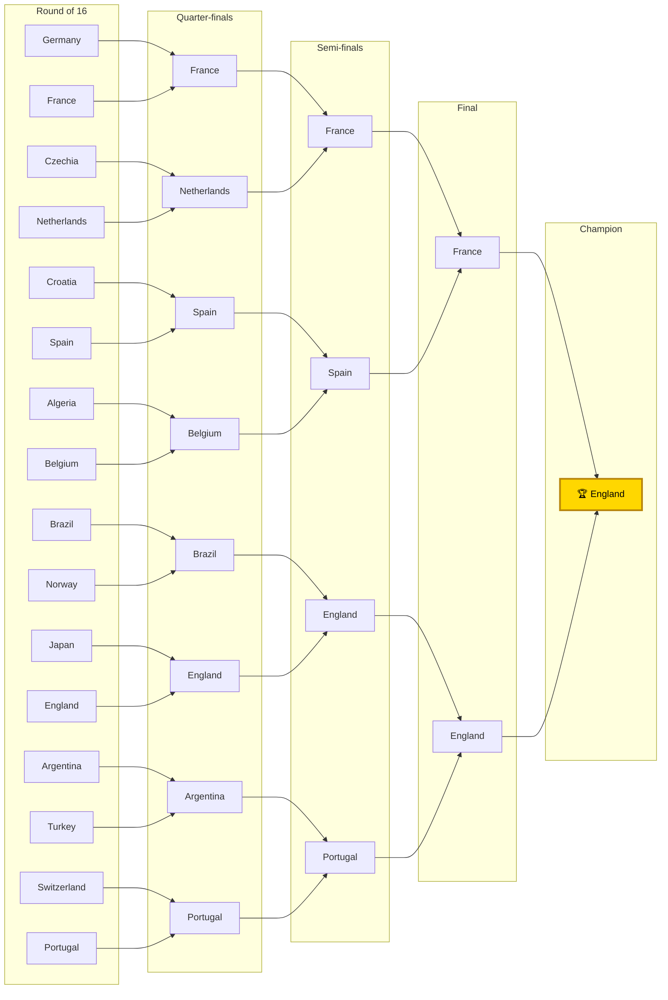

# 2026 FIFA World Cup — Full Forecast (v2, improved model)

*Generated 2026-06-13. Strength model (shrink **0.25**, **DRAW_BASE 0.45**), **100,000** Monte-Carlo simulations of the real 48-team draw on the **official 2026 knockout bracket**. Hosts (USA/Mexico/Canada) get home advantage in group games.*

## 🏆 Title odds — all 48 teams

| # | Team | Grp | GrpW | Qualify | R16 | QF | SF | Final | **Title** | ±95% |
|--:|------|:--:|:--:|:--:|:--:|:--:|:--:|:--:|:--:|:--:|
| 1 | England | L | 55% | 93% | 62% | 41% | 26% | 16% | **9.2%** | ±0.2 |
| 2 | France | I | 53% | 91% | 62% | 38% | 24% | 15% | **8.7%** | ±0.2 |
| 3 | Germany | E | 57% | 92% | 63% | 38% | 24% | 14% | **8.5%** | ±0.2 |
| 4 | Portugal | K | 54% | 91% | 57% | 37% | 22% | 13% | **7.5%** | ±0.2 |
| 5 | Argentina | J | 52% | 91% | 55% | 35% | 22% | 12% | **7.1%** | ±0.2 |
| 6 | Spain | H | 52% | 91% | 56% | 35% | 21% | 12% | **6.9%** | ±0.2 |
| 7 | Brazil | C | 50% | 89% | 53% | 32% | 19% | 11% | **6.1%** | ±0.1 |
| 8 | Netherlands | F | 45% | 88% | 53% | 33% | 18% | 10% | **5.6%** | ±0.1 |
| 9 | Belgium | G | 55% | 92% | 58% | 34% | 19% | 10% | **5.2%** | ±0.1 |
| 10 | Uruguay | H | 32% | 82% | 43% | 23% | 12% | 6% | **2.8%** | ±0.1 |
| 11 | Switzerland | B | 39% | 82% | 48% | 25% | 12% | 6% | **2.8%** | ±0.1 |
| 12 | Norway | I | 24% | 76% | 42% | 21% | 11% | 5% | **2.3%** | ±0.1 |
| 13 | Croatia | L | 24% | 77% | 40% | 20% | 10% | 5% | **2.1%** | ±0.1 |
| 14 | Sweden | F | 27% | 77% | 39% | 21% | 10% | 5% | **2.0%** | ±0.1 |
| 15 | Austria | J | 24% | 75% | 37% | 19% | 9% | 4% | **1.8%** | ±0.1 |
| 16 | Ivory Coast | E | 23% | 74% | 39% | 18% | 9% | 4% | **1.7%** | ±0.1 |
| 17 | Colombia | K | 23% | 72% | 35% | 18% | 8% | 4% | **1.6%** | ±0.1 |
| 18 | Turkey | D | 30% | 77% | 40% | 19% | 9% | 4% | **1.6%** | ±0.1 |
| 19 | Morocco | C | 24% | 73% | 34% | 18% | 8% | 4% | **1.6%** | ±0.1 |
| 20 | Japan | F | 22% | 72% | 35% | 17% | 8% | 3% | **1.5%** | ±0.1 |
| 21 | USA | D | 43% | 86% | 42% | 19% | 8% | 3% | **1.3%** | ±0.1 |
| 22 | Senegal | I | 17% | 65% | 32% | 14% | 6% | 3% | **1.1%** | ±0.1 |
| 23 | Algeria | J | 18% | 67% | 30% | 14% | 6% | 3% | **1.0%** | ±0.1 |
| 24 | Scotland | C | 18% | 65% | 29% | 14% | 6% | 2% | **1.0%** | ±0.1 |
| 25 | Ghana | L | 17% | 68% | 31% | 14% | 6% | 3% | **1.0%** | ±0.1 |
| 26 | Egypt | G | 23% | 75% | 37% | 16% | 7% | 3% | **1.0%** | ±0.1 |
| 27 | Czechia | A | 28% | 73% | 34% | 13% | 5% | 2% | **0.8%** | ±0.1 |
| 28 | Mexico | A | 39% | 81% | 36% | 14% | 5% | 2% | **0.7%** | ±0.1 |
| 29 | Bosnia and Herzegovina | B | 20% | 64% | 31% | 12% | 5% | 2% | **0.7%** | ±0.1 |
| 30 | DR Congo | K | 14% | 58% | 24% | 10% | 4% | 2% | **0.6%** | ±0.0 |
| 31 | Canada | B | 29% | 74% | 34% | 13% | 5% | 2% | **0.6%** | ±0.0 |
| 32 | Ecuador | E | 12% | 55% | 24% | 9% | 3% | 1% | **0.5%** | ±0.0 |
| 33 | Iran | G | 16% | 64% | 28% | 11% | 4% | 1% | **0.5%** | ±0.0 |
| 34 | Paraguay | D | 17% | 61% | 26% | 10% | 4% | 1% | **0.5%** | ±0.0 |
| 35 | South Korea | A | 19% | 61% | 25% | 9% | 3% | 1% | **0.4%** | ±0.0 |
| 36 | Qatar | B | 12% | 49% | 21% | 7% | 3% | 1% | **0.3%** | ±0.0 |
| 37 | South Africa | A | 14% | 54% | 21% | 7% | 2% | 1% | **0.2%** | ±0.0 |
| 38 | Uzbekistan | K | 9% | 44% | 16% | 6% | 2% | 1% | **0.2%** | ±0.0 |
| 39 | Cape Verde | H | 9% | 47% | 17% | 7% | 2% | 1% | **0.2%** | ±0.0 |
| 40 | Curacao | E | 8% | 43% | 16% | 6% | 2% | 1% | **0.2%** | ±0.0 |
| 41 | Haiti | C | 8% | 40% | 14% | 5% | 2% | 1% | **0.2%** | ±0.0 |
| 42 | Australia | D | 10% | 45% | 16% | 5% | 2% | 0% | **0.1%** | ±0.0 |
| 43 | Saudi Arabia | H | 8% | 43% | 14% | 5% | 2% | 1% | **0.1%** | ±0.0 |
| 44 | Iraq | I | 5% | 34% | 12% | 4% | 1% | 0% | **0.1%** | ±0.0 |
| 45 | Tunisia | F | 6% | 32% | 11% | 3% | 1% | 0% | **0.1%** | ±0.0 |
| 46 | Jordan | J | 6% | 34% | 11% | 4% | 1% | 0% | **0.1%** | ±0.0 |
| 47 | New Zealand | G | 6% | 35% | 11% | 3% | 1% | 0% | **0.1%** | ±0.0 |
| 48 | Panama | L | 4% | 28% | 8% | 2% | 1% | 0% | **0.0%** | ±0.0 |

## Group-stage schedule — all 12 groups (72 fixtures)

`(H)` = host plays at home. Verdict = rule-based confidence label.

### Group A — Mexico, South Africa, South Korea, Czechia
| Fixture | Verdict |
|---|---|
| Mexico vs South Africa (H) | Mexico favoured *(low conf.)* |
| Mexico vs South Korea (H) | Slight lean to Mexico *(low conf.)* |
| Mexico vs Czechia (H) | Slight lean to Mexico *(low conf.)* |
| South Africa vs South Korea | Coin flip — too close to call *(low conf.)* |
| South Africa vs Czechia | Slight lean to Czechia *(low conf.)* |
| South Korea vs Czechia | Slight lean to Czechia *(low conf.)* |

### Group B — Canada, Bosnia and Herzegovina, Qatar, Switzerland
| Fixture | Verdict |
|---|---|
| Canada vs Bosnia and Herzegovina (H) | Slight lean to Canada *(low conf.)* |
| Canada vs Qatar (H) | Slight lean to Canada *(low conf.)* |
| Canada vs Switzerland (H) | Slight lean to Switzerland *(low conf.)* |
| Bosnia and Herzegovina vs Qatar | Slight lean to Bosnia and Herzegovina *(low conf.)* |
| Bosnia and Herzegovina vs Switzerland | Slight lean to Switzerland *(low conf.)* |
| Qatar vs Switzerland | Switzerland favoured *(low conf.)* |

### Group C — Brazil, Morocco, Haiti, Scotland
| Fixture | Verdict |
|---|---|
| Brazil vs Morocco | Slight lean to Brazil *(low conf.)* |
| Brazil vs Haiti | Brazil clear favourite *(low conf.)* |
| Brazil vs Scotland | Brazil favoured *(low conf.)* |
| Morocco vs Haiti | Morocco favoured *(low conf.)* |
| Morocco vs Scotland | Coin flip — too close to call *(low conf.)* |
| Haiti vs Scotland | Slight lean to Scotland *(low conf.)* |

### Group D — USA, Paraguay, Australia, Turkey
| Fixture | Verdict |
|---|---|
| USA vs Paraguay (H) | USA favoured *(low conf.)* |
| USA vs Australia (H) | USA favoured *(low conf.)* |
| USA vs Turkey (H) | Slight lean to USA *(low conf.)* |
| Paraguay vs Australia | Slight lean to Paraguay *(low conf.)* |
| Paraguay vs Turkey | Slight lean to Turkey *(low conf.)* |
| Australia vs Turkey | Turkey favoured *(low conf.)* |

### Group E — Germany, Curacao, Ivory Coast, Ecuador
| Fixture | Verdict |
|---|---|
| Germany vs Curacao | Germany clear favourite *(low conf.)* |
| Germany vs Ivory Coast | Germany favoured *(low conf.)* |
| Germany vs Ecuador | Germany clear favourite *(low conf.)* |
| Curacao vs Ivory Coast | Ivory Coast favoured *(low conf.)* |
| Curacao vs Ecuador | Slight lean to Ecuador *(low conf.)* |
| Ivory Coast vs Ecuador | Slight lean to Ivory Coast *(low conf.)* |

### Group F — Netherlands, Japan, Sweden, Tunisia
| Fixture | Verdict |
|---|---|
| Netherlands vs Japan | Slight lean to Netherlands *(low conf.)* |
| Netherlands vs Sweden | Slight lean to Netherlands *(low conf.)* |
| Netherlands vs Tunisia | Netherlands clear favourite *(low conf.)* |
| Japan vs Sweden | Coin flip — too close to call *(low conf.)* |
| Japan vs Tunisia | Japan favoured *(low conf.)* |
| Sweden vs Tunisia | Sweden favoured *(low conf.)* |

### Group G — Belgium, Egypt, Iran, New Zealand
| Fixture | Verdict |
|---|---|
| Belgium vs Egypt | Belgium favoured *(low conf.)* |
| Belgium vs Iran | Belgium favoured *(low conf.)* |
| Belgium vs New Zealand | Belgium clear favourite *(low conf.)* |
| Egypt vs Iran | Slight lean to Egypt *(low conf.)* |
| Egypt vs New Zealand | Egypt favoured *(low conf.)* |
| Iran vs New Zealand | Iran favoured *(low conf.)* |

### Group H — Spain, Cape Verde, Saudi Arabia, Uruguay
| Fixture | Verdict |
|---|---|
| Spain vs Cape Verde | Spain clear favourite *(low conf.)* |
| Spain vs Saudi Arabia | Spain clear favourite *(low conf.)* |
| Spain vs Uruguay | Slight lean to Spain *(low conf.)* |
| Cape Verde vs Saudi Arabia | Coin flip — too close to call *(low conf.)* |
| Cape Verde vs Uruguay | Uruguay favoured *(low conf.)* |
| Saudi Arabia vs Uruguay | Uruguay favoured *(low conf.)* |

### Group I — France, Senegal, Iraq, Norway
| Fixture | Verdict |
|---|---|
| France vs Senegal | France favoured *(low conf.)* |
| France vs Iraq | France clear favourite *(low conf.)* |
| France vs Norway | France favoured *(low conf.)* |
| Senegal vs Iraq | Senegal favoured *(low conf.)* |
| Senegal vs Norway | Slight lean to Norway *(low conf.)* |
| Iraq vs Norway | Norway favoured *(low conf.)* |

### Group J — Argentina, Algeria, Austria, Jordan
| Fixture | Verdict |
|---|---|
| Argentina vs Algeria | Argentina favoured *(low conf.)* |
| Argentina vs Austria | Argentina favoured *(low conf.)* |
| Argentina vs Jordan | Argentina clear favourite *(low conf.)* |
| Algeria vs Austria | Coin flip — too close to call *(low conf.)* |
| Algeria vs Jordan | Algeria favoured *(low conf.)* |
| Austria vs Jordan | Austria favoured *(low conf.)* |

### Group K — Portugal, DR Congo, Uzbekistan, Colombia
| Fixture | Verdict |
|---|---|
| Portugal vs DR Congo | Portugal favoured *(low conf.)* |
| Portugal vs Uzbekistan | Portugal clear favourite *(low conf.)* |
| Portugal vs Colombia | Portugal favoured *(low conf.)* |
| DR Congo vs Uzbekistan | Slight lean to DR Congo *(low conf.)* |
| DR Congo vs Colombia | Slight lean to Colombia *(low conf.)* |
| Uzbekistan vs Colombia | Colombia favoured *(low conf.)* |

### Group L — England, Croatia, Ghana, Panama
| Fixture | Verdict |
|---|---|
| England vs Croatia | England favoured *(low conf.)* |
| England vs Ghana | England favoured *(low conf.)* |
| England vs Panama | England clear favourite |
| Croatia vs Ghana | Slight lean to Croatia *(low conf.)* |
| Croatia vs Panama | Croatia clear favourite *(low conf.)* |
| Ghana vs Panama | Ghana favoured *(low conf.)* |

## Favourites' bracket (chalk on the official template)

**Group winners (by strength, incl. host advantage):** Mexico, Switzerland, Brazil, USA, Germany, Netherlands, Belgium, Spain, France, Argentina, Portugal, England.

**Champion (chalk): England.**

## Caveats
- Title odds are the forecast; the chalk bracket is the single most likely path (tiny exact probability — real tournaments are upset-heavy).
- Knockout uses the **official 2026 bracket template**; best-thirds matched to FIFA-allocated slots.
- Draw rate calibrated to ~25%; a residual ~2.6pp under-prediction remains (kept so home advantage still helps underdogs).
- ~11 backfilled teams use real squads with estimated overalls; Elo self-corrects as results are logged.

*Reproduce: `python tournament.py -n 100000` · fixtures: `python tournament.py --fixtures`*
