# 2026 FIFA World Cup — Live Group-to-Bracket Projection

*Generated 2026-06-16. Conditioned on the 20 results played so far (`--live`). Group winner = most-likely group winner (P finish 1st); 2nd/3rd ordered by P(qualify); the 8 qualifying thirds are the highest-P(qualify) third-placed teams that fit FIFA's slot table. Knockout = official 2026 bracket, favourite advances. ✓ = projected to qualify.*

```mermaid
flowchart LR
  classDef champ fill:#ffd700,stroke:#b8860b,stroke-width:3px,color:#000;
  subgraph GA["Group A"]
    direction TB
    g_Mexico["1. Mexico ✓"]
    g_South_Korea["2. South Korea ✓"]
    g_Czechia["3. Czechia ✓"]
    g_South_Africa["4. South Africa"]
  end
  subgraph GB["Group B"]
    direction TB
    g_Switzerland["1. Switzerland ✓"]
    g_Canada["2. Canada ✓"]
    g_Bosnia_and_Herzegovina["3. Bosnia and Herzegovina ✓"]
    g_Qatar["4. Qatar"]
  end
  subgraph GC["Group C"]
    direction TB
    g_Brazil["1. Brazil ✓"]
    g_Scotland["2. Scotland ✓"]
    g_Morocco["3. Morocco ✓"]
    g_Haiti["4. Haiti"]
  end
  subgraph GD["Group D"]
    direction TB
    g_USA["1. USA ✓"]
    g_Australia["2. Australia ✓"]
    g_Turkey["3. Turkey"]
    g_Paraguay["4. Paraguay"]
  end
  subgraph GE["Group E"]
    direction TB
    g_Germany["1. Germany ✓"]
    g_Ivory_Coast["2. Ivory Coast ✓"]
    g_Ecuador["3. Ecuador"]
    g_Curacao["4. Curacao"]
  end
  subgraph GF["Group F"]
    direction TB
    g_Netherlands["1. Netherlands ✓"]
    g_Sweden["2. Sweden ✓"]
    g_Japan["3. Japan ✓"]
    g_Tunisia["4. Tunisia"]
  end
  subgraph GG["Group G"]
    direction TB
    g_Belgium["1. Belgium ✓"]
    g_Egypt["2. Egypt ✓"]
    g_Iran["3. Iran"]
    g_New_Zealand["4. New Zealand"]
  end
  subgraph GH["Group H"]
    direction TB
    g_Spain["1. Spain ✓"]
    g_Uruguay["2. Uruguay ✓"]
    g_Cape_Verde["3. Cape Verde ✓"]
    g_Saudi_Arabia["4. Saudi Arabia"]
  end
  subgraph GI["Group I"]
    direction TB
    g_France["1. France ✓"]
    g_Norway["2. Norway ✓"]
    g_Senegal["3. Senegal ✓"]
    g_Iraq["4. Iraq"]
  end
  subgraph GJ["Group J"]
    direction TB
    g_Argentina["1. Argentina ✓"]
    g_Austria["2. Austria ✓"]
    g_Algeria["3. Algeria"]
    g_Jordan["4. Jordan"]
  end
  subgraph GK["Group K"]
    direction TB
    g_Portugal["1. Portugal ✓"]
    g_Colombia["2. Colombia ✓"]
    g_DR_Congo["3. DR Congo ✓"]
    g_Uzbekistan["4. Uzbekistan"]
  end
  subgraph GL["Group L"]
    direction TB
    g_England["1. England ✓"]
    g_Croatia["2. Croatia ✓"]
    g_Ghana["3. Ghana ✓"]
    g_Panama["4. Panama"]
  end
  subgraph K1["Round of 16"]
    direction TB
    k1_Canada["Canada"]
    k1_Germany["Germany"]
    k1_Netherlands["Netherlands"]
    k1_Brazil["Brazil"]
    k1_France["France"]
    k1_Norway["Norway"]
    k1_Senegal["Senegal"]
    k1_England["England"]
    k1_USA["USA"]
    k1_Belgium["Belgium"]
    k1_Croatia["Croatia"]
    k1_Spain["Spain"]
    k1_Switzerland["Switzerland"]
    k1_Argentina["Argentina"]
    k1_Portugal["Portugal"]
    k1_Egypt["Egypt"]
  end
  subgraph K2["Quarter-finals"]
    direction TB
    k2_France["France"]
    k2_Netherlands["Netherlands"]
    k2_Brazil["Brazil"]
    k2_England["England"]
    k2_Spain["Spain"]
    k2_Belgium["Belgium"]
    k2_Argentina["Argentina"]
    k2_Portugal["Portugal"]
  end
  subgraph K3["Semi-finals"]
    direction TB
    k3_France["France"]
    k3_Spain["Spain"]
    k3_England["England"]
    k3_Argentina["Argentina"]
  end
  subgraph K4["Final"]
    direction TB
    k4_France["France"]
    k4_England["England"]
  end
  subgraph KC["Champion"]
    champ["🏆 France"]
  end
  g_South_Korea --> k1_Canada
  g_Canada --> k1_Canada
  g_Germany --> k1_Germany
  g_Czechia --> k1_Germany
  g_Netherlands --> k1_Netherlands
  g_Scotland --> k1_Netherlands
  g_Brazil --> k1_Brazil
  g_Sweden --> k1_Brazil
  g_France --> k1_France
  g_Morocco --> k1_France
  g_Ivory_Coast --> k1_Norway
  g_Norway --> k1_Norway
  g_Mexico --> k1_Senegal
  g_Senegal --> k1_Senegal
  g_England --> k1_England
  g_DR_Congo --> k1_England
  g_USA --> k1_USA
  g_Bosnia_and_Herzegovina --> k1_USA
  g_Belgium --> k1_Belgium
  g_Cape_Verde --> k1_Belgium
  g_Colombia --> k1_Croatia
  g_Croatia --> k1_Croatia
  g_Spain --> k1_Spain
  g_Austria --> k1_Spain
  g_Switzerland --> k1_Switzerland
  g_Japan --> k1_Switzerland
  g_Argentina --> k1_Argentina
  g_Uruguay --> k1_Argentina
  g_Portugal --> k1_Portugal
  g_Ghana --> k1_Portugal
  g_Australia --> k1_Egypt
  g_Egypt --> k1_Egypt
  k1_Germany --> k2_France
  k1_France --> k2_France
  k1_Canada --> k2_Netherlands
  k1_Netherlands --> k2_Netherlands
  k1_Brazil --> k2_Brazil
  k1_Norway --> k2_Brazil
  k1_Senegal --> k2_England
  k1_England --> k2_England
  k1_Croatia --> k2_Spain
  k1_Spain --> k2_Spain
  k1_USA --> k2_Belgium
  k1_Belgium --> k2_Belgium
  k1_Argentina --> k2_Argentina
  k1_Egypt --> k2_Argentina
  k1_Switzerland --> k2_Portugal
  k1_Portugal --> k2_Portugal
  k2_France --> k3_France
  k2_Netherlands --> k3_France
  k2_Spain --> k3_Spain
  k2_Belgium --> k3_Spain
  k2_Brazil --> k3_England
  k2_England --> k3_England
  k2_Argentina --> k3_Argentina
  k2_Portugal --> k3_Argentina
  k3_France --> k4_France
  k3_Spain --> k4_France
  k3_England --> k4_England
  k3_Argentina --> k4_England
  k4_France --> champ
  k4_England --> champ
  class champ champ;
```

**Projected champion: France.** Single most-likely path (favourite advances); exact probability is tiny — see the title-odds table for the real distribution.

**Best-third cut (by P qualify):** in — Morocco 78%, Japan 77%, Ghana 69%, DR Congo 66%, Bosnia and Herzegovina 65%, Cape Verde 57%, Senegal 53%, Czechia 52%.
  Out — Iran 51%, Algeria 49%, Turkey 46%, Ecuador 40%.
