# 2026 FIFA World Cup — Live Group-to-Bracket Projection

*Generated 2026-07-07. Conditioned on the 93 results played so far (`--live`). Group winner = most-likely group winner (P finish 1st); 2nd/3rd ordered by P(qualify). Knockout ties are seated from real R32 fixtures (played ties locked to their actual result); the official 2026 bracket then advances the favourite for unplayed games. ✓ = projected to qualify.*

```mermaid
flowchart LR
  classDef champ fill:#ffd700,stroke:#b8860b,stroke-width:3px,color:#000;
  subgraph GA["Group A"]
    direction TB
    g_Mexico["1. Mexico ✓"]
    g_South_Africa["2. South Africa ✓"]
    g_South_Korea["3. South Korea"]
    g_Czechia["4. Czechia"]
  end
  subgraph GB["Group B"]
    direction TB
    g_Switzerland["1. Switzerland ✓"]
    g_Canada["2. Canada ✓"]
    g_Bosnia_and_Herzegovina["3. Bosnia and Herzegovina ✓"]
    g_Qatar["4. Qatar"]
  end
  subgraph GC["Group C"]
    direction TB
    g_Brazil["1. Brazil ✓"]
    g_Morocco["2. Morocco ✓"]
    g_Scotland["3. Scotland"]
    g_Haiti["4. Haiti"]
  end
  subgraph GD["Group D"]
    direction TB
    g_USA["1. USA ✓"]
    g_Australia["2. Australia ✓"]
    g_Paraguay["3. Paraguay ✓"]
    g_Turkey["4. Turkey"]
  end
  subgraph GE["Group E"]
    direction TB
    g_Germany["1. Germany ✓"]
    g_Ivory_Coast["2. Ivory Coast ✓"]
    g_Ecuador["3. Ecuador ✓"]
    g_Curacao["4. Curacao"]
  end
  subgraph GF["Group F"]
    direction TB
    g_Netherlands["1. Netherlands ✓"]
    g_Japan["2. Japan ✓"]
    g_Sweden["3. Sweden ✓"]
    g_Tunisia["4. Tunisia"]
  end
  subgraph GG["Group G"]
    direction TB
    g_Belgium["1. Belgium ✓"]
    g_Egypt["2. Egypt ✓"]
    g_Iran["3. Iran"]
    g_New_Zealand["4. New Zealand"]
  end
  subgraph GH["Group H"]
    direction TB
    g_Spain["1. Spain ✓"]
    g_Cape_Verde["2. Cape Verde ✓"]
    g_Uruguay["3. Uruguay"]
    g_Saudi_Arabia["4. Saudi Arabia"]
  end
  subgraph GI["Group I"]
    direction TB
    g_France["1. France ✓"]
    g_Norway["2. Norway ✓"]
    g_Senegal["3. Senegal ✓"]
    g_Iraq["4. Iraq"]
  end
  subgraph GJ["Group J"]
    direction TB
    g_Argentina["1. Argentina ✓"]
    g_Austria["2. Austria ✓"]
    g_Algeria["3. Algeria ✓"]
    g_Jordan["4. Jordan"]
  end
  subgraph GK["Group K"]
    direction TB
    g_Colombia["1. Colombia ✓"]
    g_Portugal["2. Portugal ✓"]
    g_DR_Congo["3. DR Congo ✓"]
    g_Uzbekistan["4. Uzbekistan"]
  end
  subgraph GL["Group L"]
    direction TB
    g_England["1. England ✓"]
    g_Croatia["2. Croatia ✓"]
    g_Ghana["3. Ghana ✓"]
    g_Panama["4. Panama"]
  end
  subgraph K1["Round of 16"]
    direction TB
    k1_Canada["Canada"]
    k1_Paraguay["Paraguay"]
    k1_Morocco["Morocco"]
    k1_Brazil["Brazil"]
    k1_France["France"]
    k1_Norway["Norway"]
    k1_Mexico["Mexico"]
    k1_England["England"]
    k1_USA["USA"]
    k1_Belgium["Belgium"]
    k1_Portugal["Portugal"]
    k1_Spain["Spain"]
    k1_Switzerland["Switzerland"]
    k1_Argentina["Argentina"]
    k1_Colombia["Colombia"]
    k1_Egypt["Egypt"]
  end
  subgraph K2["Quarter-finals"]
    direction TB
    k2_France["France"]
    k2_Morocco["Morocco"]
    k2_Norway["Norway"]
    k2_England["England"]
    k2_Spain["Spain"]
    k2_Belgium["Belgium"]
    k2_Argentina["Argentina"]
    k2_Switzerland["Switzerland"]
  end
  subgraph K3["Semi-finals"]
    direction TB
    k3_France["France"]
    k3_Spain["Spain"]
    k3_England["England"]
    k3_Argentina["Argentina"]
  end
  subgraph K4["Final"]
    direction TB
    k4_France["France"]
    k4_England["England"]
  end
  subgraph KC["Champion"]
    champ["🏆 France"]
  end
  g_South_Africa --> k1_Canada
  g_Canada --> k1_Canada
  g_Germany --> k1_Paraguay
  g_Paraguay --> k1_Paraguay
  g_Netherlands --> k1_Morocco
  g_Morocco --> k1_Morocco
  g_Brazil --> k1_Brazil
  g_Japan --> k1_Brazil
  g_France --> k1_France
  g_Sweden --> k1_France
  g_Ivory_Coast --> k1_Norway
  g_Norway --> k1_Norway
  g_Mexico --> k1_Mexico
  g_Ecuador --> k1_Mexico
  g_England --> k1_England
  g_DR_Congo --> k1_England
  g_USA --> k1_USA
  g_Bosnia_and_Herzegovina --> k1_USA
  g_Belgium --> k1_Belgium
  g_Senegal --> k1_Belgium
  g_Portugal --> k1_Portugal
  g_Croatia --> k1_Portugal
  g_Spain --> k1_Spain
  g_Austria --> k1_Spain
  g_Switzerland --> k1_Switzerland
  g_Algeria --> k1_Switzerland
  g_Argentina --> k1_Argentina
  g_Cape_Verde --> k1_Argentina
  g_Colombia --> k1_Colombia
  g_Ghana --> k1_Colombia
  g_Australia --> k1_Egypt
  g_Egypt --> k1_Egypt
  k1_Paraguay --> k2_France
  k1_France --> k2_France
  k1_Canada --> k2_Morocco
  k1_Morocco --> k2_Morocco
  k1_Brazil --> k2_Norway
  k1_Norway --> k2_Norway
  k1_Mexico --> k2_England
  k1_England --> k2_England
  k1_Portugal --> k2_Spain
  k1_Spain --> k2_Spain
  k1_USA --> k2_Belgium
  k1_Belgium --> k2_Belgium
  k1_Argentina --> k2_Argentina
  k1_Egypt --> k2_Argentina
  k1_Switzerland --> k2_Switzerland
  k1_Colombia --> k2_Switzerland
  k2_France --> k3_France
  k2_Morocco --> k3_France
  k2_Spain --> k3_Spain
  k2_Belgium --> k3_Spain
  k2_Norway --> k3_England
  k2_England --> k3_England
  k2_Argentina --> k3_Argentina
  k2_Switzerland --> k3_Argentina
  k3_France --> k4_France
  k3_Spain --> k4_France
  k3_England --> k4_England
  k3_Argentina --> k4_England
  k4_France --> champ
  k4_England --> champ
  class champ champ;
```

**Projected champion: France.** Single most-likely path (favourite advances); exact probability is tiny — see the title-odds table for the real distribution.

**Best-third cut (by P qualify):** in — Bosnia and Herzegovina 100%, Paraguay 100%, Ecuador 100%, Senegal 100%, Algeria 100%, DR Congo 100%, Ghana 100%, Sweden 61%.
  Out — Iran 39%, South Korea 0%, Scotland 0%, Uruguay 0%.

## Projected finish by team (most-likely bracket)

*Each team mapped to the single stage it is eliminated at in the favourite-advances bracket above. This is one most-likely scenario (every favourite wins), not a probability — see WORLD_CUP_2026_ELIMINATION.md for the full per-stage odds.*

| Stage | Teams |
|---|---|
| **Winner** (1) | France |
| **Runner-Up** (1) | England |
| **Semi-Finals** (2) | Argentina, Spain |
| **Quarter-Finals** (4) | Belgium, Morocco, Norway, Switzerland |
| **Last 16** (8) | Brazil, Canada, Colombia, Egypt, Mexico, Paraguay, Portugal, USA |
| **Last 32** (16) | Algeria, Australia, Austria, Bosnia and Herzegovina, Cape Verde, Croatia, DR Congo, Ecuador, Germany, Ghana, Ivory Coast, Japan, Netherlands, Senegal, South Africa, Sweden |
| **Group Stage** (16) | Curacao, Czechia, Haiti, Iran, Iraq, Jordan, New Zealand, Panama, Qatar, Saudi Arabia, Scotland, South Korea, Tunisia, Turkey, Uruguay, Uzbekistan |
