# 2026 FIFA World Cup — Live Group-to-Bracket Projection

*Generated 2026-06-15. Conditioned on the 13 results played so far (`--live`). Group winner = most-likely group winner (P finish 1st); 2nd/3rd ordered by P(qualify); the 8 qualifying thirds are the highest-P(qualify) third-placed teams that fit FIFA's slot table. Knockout = official 2026 bracket, favourite advances. ✓ = projected to qualify.*

```mermaid
flowchart LR
  classDef champ fill:#ffd700,stroke:#b8860b,stroke-width:3px,color:#000;
  subgraph GA["Group A"]
    direction TB
    g_Mexico["1. Mexico ✓"]
    g_South_Korea["2. South Korea ✓"]
    g_Czechia["3. Czechia"]
    g_South_Africa["4. South Africa"]
  end
  subgraph GB["Group B"]
    direction TB
    g_Switzerland["1. Switzerland ✓"]
    g_Canada["2. Canada ✓"]
    g_Bosnia_and_Herzegovina["3. Bosnia and Herzegovina ✓"]
    g_Qatar["4. Qatar"]
  end
  subgraph GC["Group C"]
    direction TB
    g_Brazil["1. Brazil ✓"]
    g_Scotland["2. Scotland ✓"]
    g_Morocco["3. Morocco ✓"]
    g_Haiti["4. Haiti"]
  end
  subgraph GD["Group D"]
    direction TB
    g_USA["1. USA ✓"]
    g_Australia["2. Australia ✓"]
    g_Turkey["3. Turkey"]
    g_Paraguay["4. Paraguay"]
  end
  subgraph GE["Group E"]
    direction TB
    g_Germany["1. Germany ✓"]
    g_Ivory_Coast["2. Ivory Coast ✓"]
    g_Ecuador["3. Ecuador"]
    g_Curacao["4. Curacao"]
  end
  subgraph GF["Group F"]
    direction TB
    g_Netherlands["1. Netherlands ✓"]
    g_Japan["2. Japan ✓"]
    g_Sweden["3. Sweden ✓"]
    g_Tunisia["4. Tunisia"]
  end
  subgraph GG["Group G"]
    direction TB
    g_Belgium["1. Belgium ✓"]
    g_Egypt["2. Egypt ✓"]
    g_Iran["3. Iran ✓"]
    g_New_Zealand["4. New Zealand"]
  end
  subgraph GH["Group H"]
    direction TB
    g_Uruguay["1. Uruguay ✓"]
    g_Spain["2. Spain ✓"]
    g_Cape_Verde["3. Cape Verde"]
    g_Saudi_Arabia["4. Saudi Arabia"]
  end
  subgraph GI["Group I"]
    direction TB
    g_France["1. France ✓"]
    g_Norway["2. Norway ✓"]
    g_Senegal["3. Senegal ✓"]
    g_Iraq["4. Iraq"]
  end
  subgraph GJ["Group J"]
    direction TB
    g_Argentina["1. Argentina ✓"]
    g_Austria["2. Austria ✓"]
    g_Algeria["3. Algeria ✓"]
    g_Jordan["4. Jordan"]
  end
  subgraph GK["Group K"]
    direction TB
    g_Portugal["1. Portugal ✓"]
    g_Colombia["2. Colombia ✓"]
    g_DR_Congo["3. DR Congo ✓"]
    g_Uzbekistan["4. Uzbekistan"]
  end
  subgraph GL["Group L"]
    direction TB
    g_England["1. England ✓"]
    g_Croatia["2. Croatia ✓"]
    g_Ghana["3. Ghana ✓"]
    g_Panama["4. Panama"]
  end
  subgraph K1["Round of 16"]
    direction TB
    r1_Canada["Canada"]
    r1_Germany["Germany"]
    r1_Netherlands["Netherlands"]
    r1_Brazil["Brazil"]
    r1_France["France"]
    r1_Norway["Norway"]
    r1_Sweden["Sweden"]
    r1_England["England"]
    r1_Algeria["Algeria"]
    r1_Belgium["Belgium"]
    r1_Croatia["Croatia"]
    r1_Uruguay["Uruguay"]
    r1_Switzerland["Switzerland"]
    r1_Argentina["Argentina"]
    r1_Portugal["Portugal"]
    r1_Egypt["Egypt"]
  end
  subgraph K2["Quarter-finals"]
    direction TB
    r2_Germany["Germany"]
    r2_Netherlands["Netherlands"]
    r2_Brazil["Brazil"]
    r2_England["England"]
    r2_Uruguay["Uruguay"]
    r2_Belgium["Belgium"]
    r2_Argentina["Argentina"]
    r2_Portugal["Portugal"]
  end
  subgraph K3["Semi-finals"]
    direction TB
    r3_Germany["Germany"]
    r3_Belgium["Belgium"]
    r3_England["England"]
    r3_Portugal["Portugal"]
  end
  subgraph K4["Final"]
    direction TB
    r4_Germany["Germany"]
    r4_England["England"]
  end
  subgraph KC["Champion"]
    champ["🏆 England"]
  end
  g_South_Korea --> r1_Canada
  g_Canada --> r1_Canada
  g_Germany --> r1_Germany
  g_Bosnia_and_Herzegovina --> r1_Germany
  g_Netherlands --> r1_Netherlands
  g_Scotland --> r1_Netherlands
  g_Brazil --> r1_Brazil
  g_Japan --> r1_Brazil
  g_France --> r1_France
  g_Morocco --> r1_France
  g_Ivory_Coast --> r1_Norway
  g_Norway --> r1_Norway
  g_Mexico --> r1_Sweden
  g_Sweden --> r1_Sweden
  g_England --> r1_England
  g_DR_Congo --> r1_England
  g_USA --> r1_Algeria
  g_Algeria --> r1_Algeria
  g_Belgium --> r1_Belgium
  g_Senegal --> r1_Belgium
  g_Colombia --> r1_Croatia
  g_Croatia --> r1_Croatia
  g_Uruguay --> r1_Uruguay
  g_Austria --> r1_Uruguay
  g_Switzerland --> r1_Switzerland
  g_Iran --> r1_Switzerland
  g_Argentina --> r1_Argentina
  g_Spain --> r1_Argentina
  g_Portugal --> r1_Portugal
  g_Ghana --> r1_Portugal
  g_Australia --> r1_Egypt
  g_Egypt --> r1_Egypt
  r1_Germany --> r2_Germany
  r1_France --> r2_Germany
  r1_Canada --> r2_Netherlands
  r1_Netherlands --> r2_Netherlands
  r1_Brazil --> r2_Brazil
  r1_Norway --> r2_Brazil
  r1_Sweden --> r2_England
  r1_England --> r2_England
  r1_Croatia --> r2_Uruguay
  r1_Uruguay --> r2_Uruguay
  r1_Algeria --> r2_Belgium
  r1_Belgium --> r2_Belgium
  r1_Argentina --> r2_Argentina
  r1_Egypt --> r2_Argentina
  r1_Switzerland --> r2_Portugal
  r1_Portugal --> r2_Portugal
  r2_Germany --> r3_Germany
  r2_Netherlands --> r3_Germany
  r2_Uruguay --> r3_Belgium
  r2_Belgium --> r3_Belgium
  r2_Brazil --> r3_England
  r2_England --> r3_England
  r2_Argentina --> r3_Portugal
  r2_Portugal --> r3_Portugal
  r3_Germany --> r4_Germany
  r3_Belgium --> r4_Germany
  r3_England --> r4_England
  r3_Portugal --> r4_England
  r4_Germany --> champ
  r4_England --> champ
  class champ champ;
```

**Projected champion: England.** Single most-likely path (favourite advances); exact probability is tiny — see the title-odds table for the real distribution.

**Notes:** Spain's 0–0 with Cape Verde flips Group H — Uruguay is now the marginal group winner (40% vs Spain 38%), an effective coin-flip. The best-third cut falls between DR Congo (58% qualify, in) and Cape Verde (57%, out).
