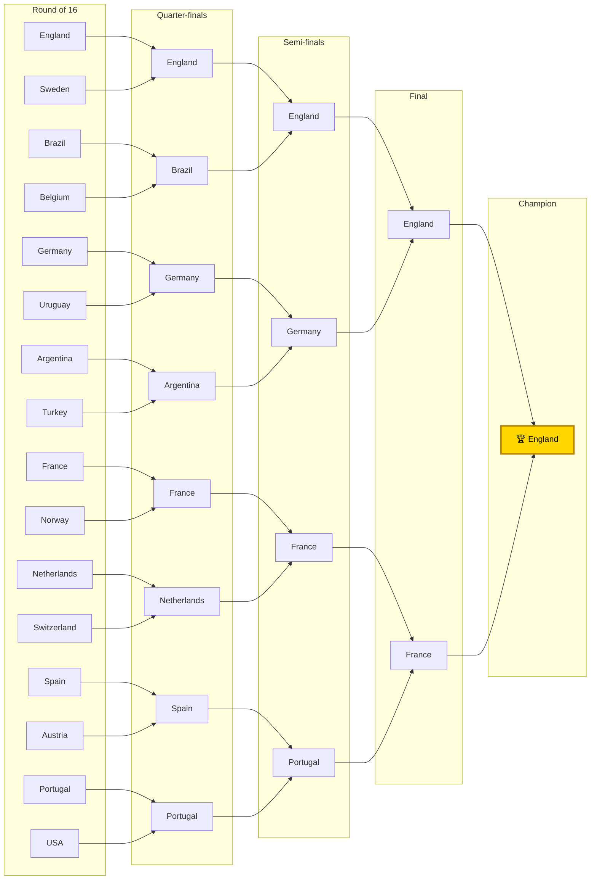

# 2026 FIFA World Cup — Forecast

*Generated 2026-06-13 from the strength model (`tournament.py`), 100,000 Monte-Carlo
simulations of the real 48-team group draw. Outcomes use the validated Elo strength
W/D/L; host nations (USA / Mexico / Canada) get home advantage in their group games;
knockout ties resolve as strength-weighted coin flips. Title probabilities carry a
95% Monte-Carlo interval of ±0.1–0.2pp.*

---

## 🏆 Title odds (100k simulations)

| # | Team | Group | Win group | Qualify | Reach final | **Title** | ±95% |
|---|------|:----:|:---:|:---:|:---:|:---:|:---:|
| 1 | **England** | L | 54% | 92% | 16% | **9.6%** | ±0.2 |
| 2 | **France** | I | 52% | 90% | 15% | **9.1%** | ±0.2 |
| 3 | **Germany** | E | 55% | 91% | 15% | **8.5%** | ±0.2 |
| 4 | **Spain** | H | 51% | 90% | 13% | **7.5%** | ±0.2 |
| 5 | **Portugal** | K | 52% | 90% | 13% | **7.3%** | ±0.2 |
| 6 | **Argentina** | J | 50% | 90% | 13% | **7.0%** | ±0.2 |
| 7 | **Brazil** | C | 48% | 88% | 11% | **6.0%** | ±0.1 |
| 8 | **Netherlands** | F | 45% | 87% | 10% | **5.6%** | ±0.1 |
| 9 | **Belgium** | G | 53% | 91% | 10% | **4.9%** | ±0.1 |
| 10 | Uruguay | H | 31% | 81% | 6% | 2.9% | ±0.1 |
| 11 | Switzerland | B | 38% | 81% | 6% | 2.6% | ±0.1 |
| 12 | Norway | I | 25% | 76% | 5% | 2.2% | ±0.1 |
| 13 | Sweden | F | 27% | 76% | 5% | 2.1% | ±0.1 |
| 14 | Croatia | L | 25% | 76% | 4% | 1.9% | ±0.1 |
| 15 | Colombia | K | 23% | 72% | 4% | 1.7% | ±0.1 |
| 16 | Austria | J | 25% | 74% | 4% | 1.7% | ±0.1 |
| 17 | Morocco | C | 24% | 72% | 4% | 1.6% | ±0.1 |
| 18 | Ivory Coast | E | 23% | 74% | 4% | 1.6% | ±0.1 |

**Read:** a wide-open field — nine credible contenders between ~5% and ~10%, no team
above 10%. England and France are co-favourites; knockout coin-flips cap everyone's
ceiling (even the favourite reaches the final only ~16% of the time).

---

## Favourites' bracket (chalk — higher-probability team advances every tie)

**Group winners:** Mexico, Switzerland, Brazil, USA, Germany, Netherlands, Belgium,
Spain, France, Argentina, Portugal, England.

**Champion (chalk): England**, beating Brazil (QF), Germany (SF) and France (final).
The England–France final mirrors the title-odds top two exactly.

---

## Caveats
- The chalk bracket is the single *most likely path*, but its exact probability of
  occurring is tiny — real tournaments are upset-heavy (a separate single random
  simulation crowned **Uzbekistan**, a ~0.3% champion). The Monte-Carlo title odds
  above are the actual forecast; the bracket is illustrative.
- The knockout bracket here is **strength-seeded**, an approximation of the official
  2026 template (the real bracket fixes which group winners/runners-up meet).
- Player ratings for backfilled teams are anchored estimates (real squads, estimated
  overalls); ratings self-correct as real results are logged in `data/results.csv`.

*Reproduce: `python tournament.py -n 100000`*
