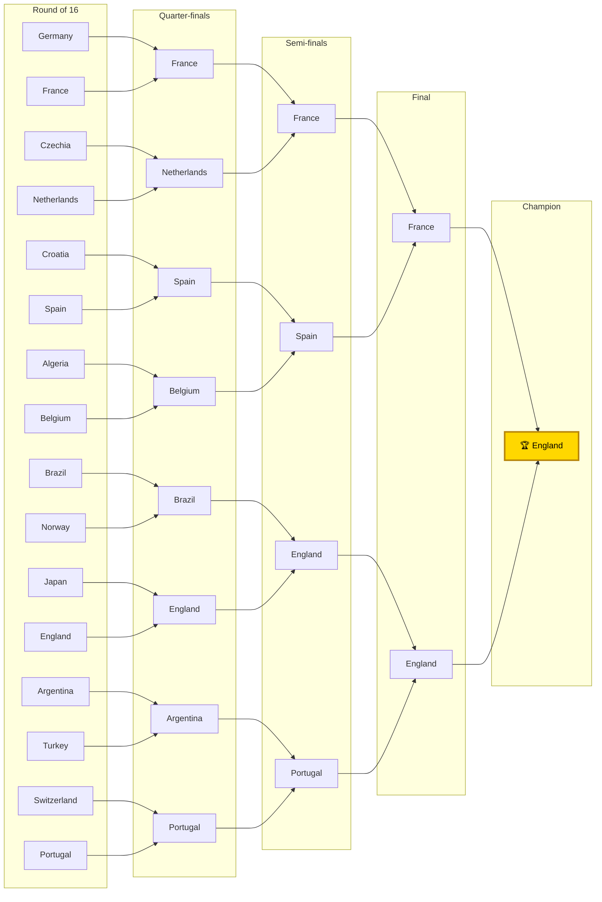

# 2026 FIFA World Cup — Forecast (v2, improved model)

*Generated 2026-06-13. Strength model with the re-validated calibration (shrink **0.25**) and corrected draw rate (**DRAW_BASE 0.45**), over **100,000** Monte-Carlo simulations of the real 48-team draw using the **official 2026 knockout bracket**. Host nations (USA/Mexico/Canada) get home advantage in group games; knockout ties are strength-weighted coin flips.*

## 🏆 Title odds (top 18)

| # | Team | Grp | Win group | Qualify | Reach final | **Title** | ±95% |
|---|------|:--:|:--:|:--:|:--:|:--:|:--:|
| 1 | England | L | 55% | 93% | 16% | **9.2%** | ±0.2 |
| 2 | France | I | 53% | 91% | 15% | **8.7%** | ±0.2 |
| 3 | Germany | E | 57% | 92% | 14% | **8.5%** | ±0.2 |
| 4 | Portugal | K | 54% | 91% | 13% | **7.5%** | ±0.2 |
| 5 | Argentina | J | 52% | 91% | 12% | **7.1%** | ±0.2 |
| 6 | Spain | H | 52% | 91% | 12% | **6.9%** | ±0.2 |
| 7 | Brazil | C | 50% | 89% | 11% | **6.1%** | ±0.1 |
| 8 | Netherlands | F | 45% | 88% | 10% | **5.6%** | ±0.1 |
| 9 | Belgium | G | 55% | 92% | 10% | **5.2%** | ±0.1 |
| 10 | Uruguay | H | 32% | 82% | 6% | **2.8%** | ±0.1 |
| 11 | Switzerland | B | 39% | 82% | 6% | **2.8%** | ±0.1 |
| 12 | Norway | I | 24% | 76% | 5% | **2.3%** | ±0.1 |
| 13 | Croatia | L | 24% | 77% | 5% | **2.1%** | ±0.1 |
| 14 | Sweden | F | 27% | 77% | 5% | **2.0%** | ±0.1 |
| 15 | Austria | J | 24% | 75% | 4% | **1.8%** | ±0.1 |
| 16 | Ivory Coast | E | 23% | 74% | 4% | **1.7%** | ±0.1 |
| 17 | Colombia | K | 23% | 72% | 4% | **1.6%** | ±0.1 |
| 18 | Turkey | D | 30% | 77% | 4% | **1.6%** | ±0.1 |

## Favourites' bracket (chalk on the official template)

**Group winners (by strength, incl. host advantage):** Mexico, Switzerland, Brazil, USA, Germany, Netherlands, Belgium, Spain, France, Argentina, Portugal, England.

**Champion (chalk): England.**

## Caveats
- Title odds are the forecast; the chalk bracket is the single most likely path (its exact probability of occurring is tiny — real tournaments are upset-heavy).
- Knockout now uses the **official 2026 bracket template** (group-position R32 pairings + real tree); best-thirds are matched to FIFA-allocated slots.
- Draw rate is calibrated to ~25% (from ~22%); a residual ~2.6pp under-prediction remains, left in place so home advantage still helps underdogs.
- ~11 backfilled teams use real squads with **estimated** overalls; Elo self-corrects as results are logged.

*Reproduce: `python tournament.py -n 100000`*
